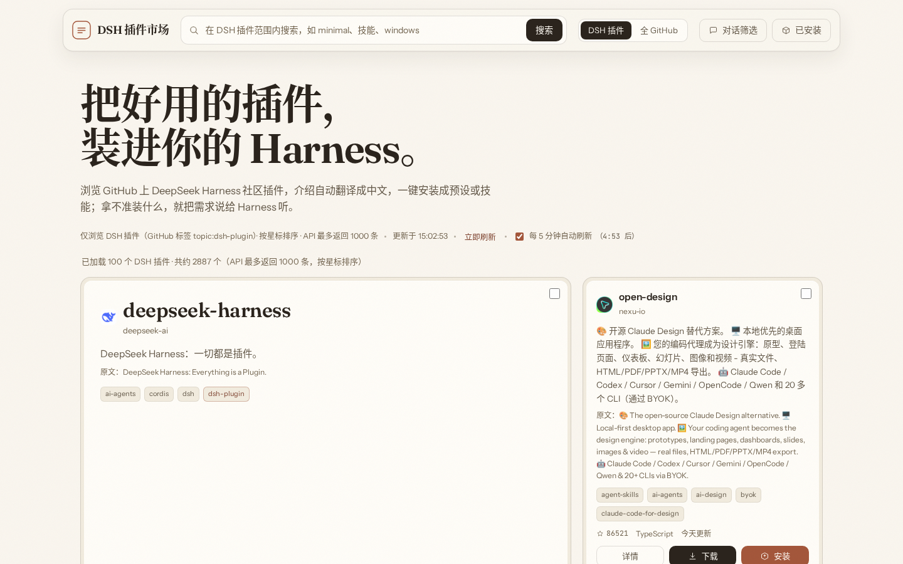

# 🧩 DSH 插件市场

[](LICENSE)
[](package.json)

一个本地运行的 **DeepSeek Harness 插件市场**：浏览 GitHub 上的社区插件、查看自动翻译成中文的介绍、一键下载安装、组合安装，并内置**直连本地 Harness 的对话筛选**。

零依赖、纯原生前端、无构建步骤，`node server.mjs` 一条命令启动。



## 功能

- **浏览与搜索**：默认限定 DSH 插件（`topic:dsh-plugin`，可一键切换"全 GitHub"范围）；每页 100 条、滚动到底自动加载下一页（API 上限 1000 条）
- **定时刷新**：每 5 分钟自动刷新（可暂停、可手动立即刷新并绕过缓存）
- **中文翻译**：卡片描述自动翻译成中文；详情页 README 一键全文翻译（前 10000 字符，30 天缓存）
- **下载与安装**：
  - `git clone` 下载到本地 `downloads/`
  - 一键安装：自动识别类型装入本机 Harness——preset（含 `agent.cordis.yml`）→ `~/.dsh/.agent-presets/<id>/`；skill（含 `SKILL.md`）→ `~/.dsh/skills/<名>/`
  - 组合安装：勾选多个插件批量安装；已安装清单可查看与卸载
- **对话筛选**：用自然语言描述需求，市场把「需求 + 候选插件列表」交给本地 Harness 智能体筛选推荐（流式回显、工具调用徽标、选择题与审批直接对话框内交互）；Harness 断连时回退本地关键词检索

## 快速开始

### 系统要求

| 依赖 | 版本 | 说明 |
|---|---|---|
| [Node.js](https://nodejs.org/) | ≥ 20 | 运行市场服务（需支持 `--experimental-websocket`，Node 20/22 均可） |
| [Git](https://git-scm.com/downloads) | ≥ 2.30 | 下载/安装插件使用；必须能被命令行调用（`git --version` 有输出） |

**Windows 注意事项：**
- 请安装**官方 Git for Windows**，不要使用 Microsoft Store 的 Git（"执行别名"占位程序无法被程序直接调用，会导致安装失败）
- 若点击"下载/安装"报 `spawn EPERM`：多为杀毒软件（360/火绒/电脑管家等）拦截了 Node 启动 git 子进程——将 `node.exe` 与 `git.exe` 加入杀软白名单，或在杀软中放行该目录
- 服务在 PowerShell / cmd 中运行即可，无需管理员权限

```sh
# 克隆后直接启动（无任何依赖需要安装）
node --experimental-websocket server.mjs
# 或使用启动脚本（自动打开浏览器，Linux/macOS）
./start.sh
```

打开 <http://127.0.0.1:3399>。

## 桌面快捷方式（三平台）

双击快捷方式 = 服务未运行则自动后台启动 + 打开浏览器页面。

| 平台 | 安装方式 | 快捷方式形态 |
|---|---|---|
| **Linux** | `tools/install-linux.sh` | 桌面 + 应用菜单的「DSH 插件市场」（.desktop） |
| **Windows** | 右键 `tools/install-windows.ps1` → "使用 PowerShell 运行" | 桌面「DSH 插件市场.lnk」（含图标，指向 `start-market.bat`） |
| **macOS** | `tools/install-macos.sh` | 桌面「DSH 插件市场.command」，双击在终端运行 |

说明：

- Windows 的 `start-market.bat` 也可直接双击使用（不装快捷方式也行）；首次使用会检查 Node.js 是否已安装
- macOS 的 `.command` 由安装脚本写入实际项目路径，移动项目目录后重新运行安装脚本即可
- Linux 若桌面不显示图标（部分 GNOME 发行版默认关闭桌面图标），可用 Super 键搜索「DSH」，或从文件管理器的"桌面"文件夹双击

### 环境变量

| 变量 | 作用 | 默认 |
|---|---|---|
| `PORT` | 服务端口 | `3399` |
| `HOST` | 监听地址 | `127.0.0.1` |
| `DSH_HOME` | Harness 主目录（安装目标） | `~/.dsh` |
| `HARNESS_URL` | 本地 Harness Web 地址（对话筛选用） | `http://127.0.0.1:3080` |
| `GITHUB_TOKEN` | GitHub 令牌，提高 API 限流额度（匿名搜索 10 次/分钟） | 无 |

## 工作原理

- **零依赖 Node 服务**（Node 20+，`--experimental-websocket` 启用 WebSocket 客户端），前端纯原生 HTML/CSS/JS
- **GitHub API**：搜索分页 1–10 页 × 100 条；结果磁盘缓存（`cache/`）；README 限流时回退 `raw.githubusercontent.com`；类型识别用 raw `HEAD` 探测（不限流）
- **翻译**：Google 免费端点（失败回退 MyMemory），30 天缓存
- **Harness 桥接**：HTTP RPC（`session.create` / `session.prompt` / `/api/respond`）+ WebSocket 事件流（`/api/events.mux`），服务端把 `assistant/chunk`、`assistant/message`、提问、审批帧折叠后以 SSE 推给浏览器
- **安装安全**：安装前基于本地克隆内容二次识别；重复安装与卸载均有冲突保护

## 开发

```sh
npm test   # 运行单元测试（node:test）
```

项目文档：

- `PRODUCT.md` — 产品事实与需求记录
- `DESIGN.md` — 视觉设计系统（Editorial Luxury）

## 项目结构

```
dsh-plugin-market/
├── server.mjs       # 服务端（GitHub 分页 / 翻译 / Harness 桥接 / 安装）
├── start.sh         # 一键启动（自动开浏览器）
├── public/          # 前端（index.html / style.css / app.js）
├── tests/           # 单元测试
├── docs/            # 文档与截图
├── PRODUCT.md       # 产品事实
├── DESIGN.md        # 设计系统记录
├── cache/           # API 与翻译缓存（运行时生成，不入库）
└── downloads/       # 已下载仓库（运行时生成，不入库）
```

## 免责声明

本工具是本地个人项目，数据与插件来自 GitHub 社区与 DeepSeek Harness 生态；与 DeepSeek 官方无关联。安装插件前请自行确认其来源可信。

## 许可证

[MIT](LICENSE)
